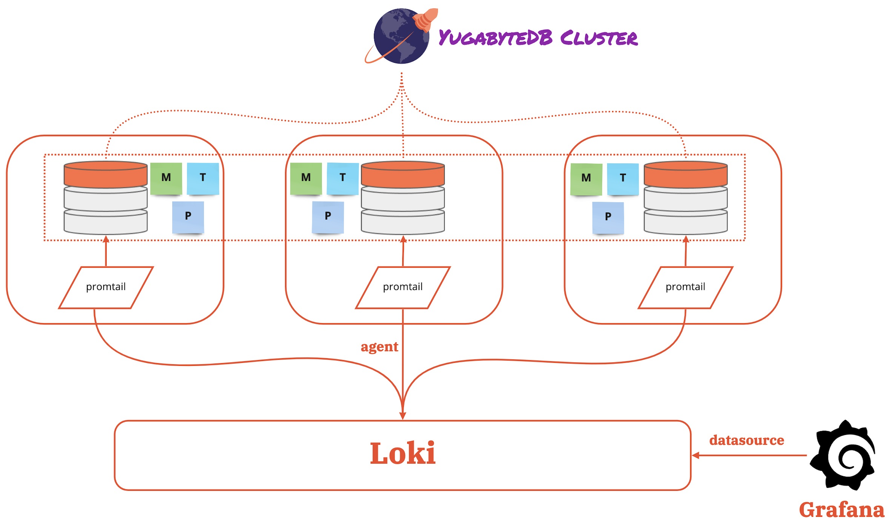

# Log Aggregation in YugabyteDB using Grafana Loki

Log aggregation is an integral part of a distributed system. As the name suggests, a distributed system will have multiple processes across multiple machines, and each process will generate a lot of data. Looking at the data in silos is time-consuming and wouldn't yield important information as the data sets still need to be correlated. Aggregating the logs is a huge productivity booster that helps to transform the raw log data into insightful information.

In a distributed system like YugabyteDB, where each process generates a ton of runtime log data points, it is precious to aggregate them in one place from an operations perspective. Aggregation helps turn the system-generated data into information that allows operations to manage the product better.

Let's look at aggregating log data from multiple processes of YugabyteDB using a trio of [Promtail](https://grafana.com/docs/loki/latest/clients/promtail/), [Loki](https://grafana.com/docs/loki/latest/), and [Grafana](https://grafana.com/docs/grafana/latest/getting-started/getting-started/). Grafana Loki is a log aggregation tool and a data store optimized for efficiently storing and querying log data.

“Loki is like Prometheus but for log data”.

Promtail is a data collector agent tailored to Loki that runs on every distributed system node. It discovers the log files on disks and forwards them with labels to Loki. The trio of Promtail, Loki, and Grafana is the ELK equivalent that completes the full log aggregation stack.

